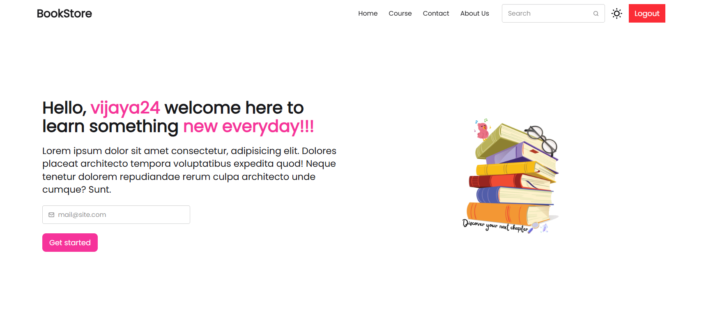
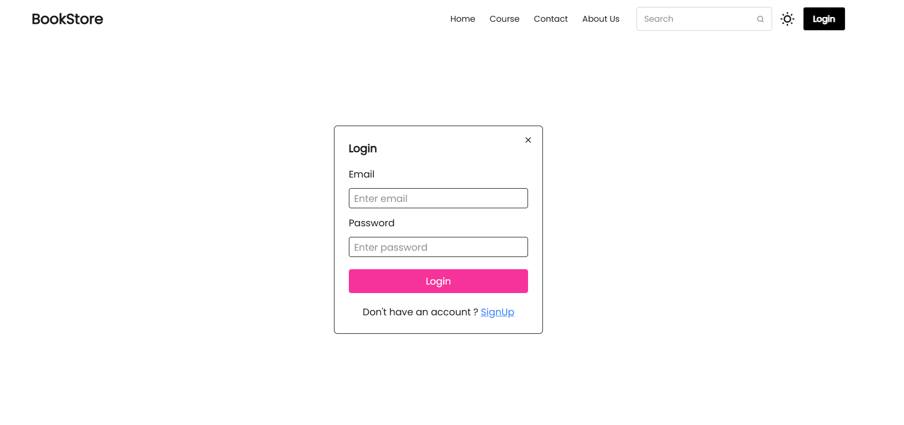
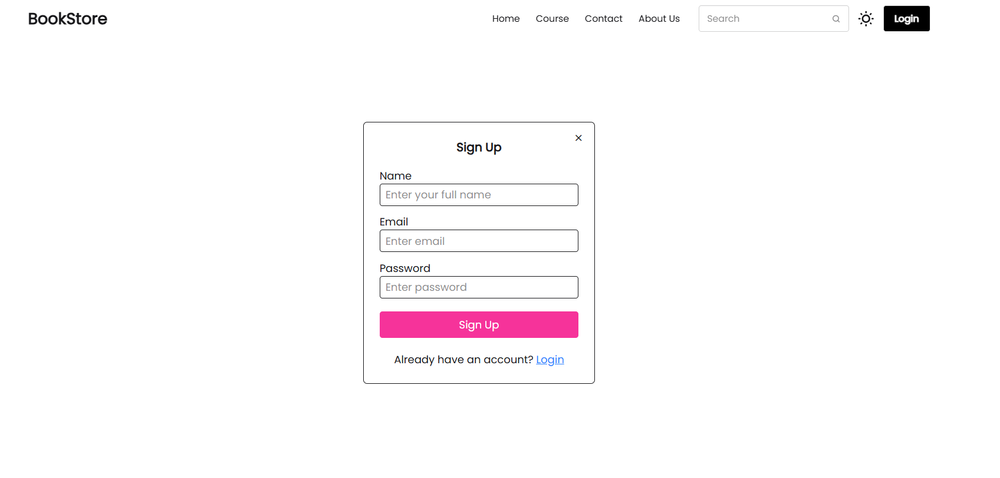
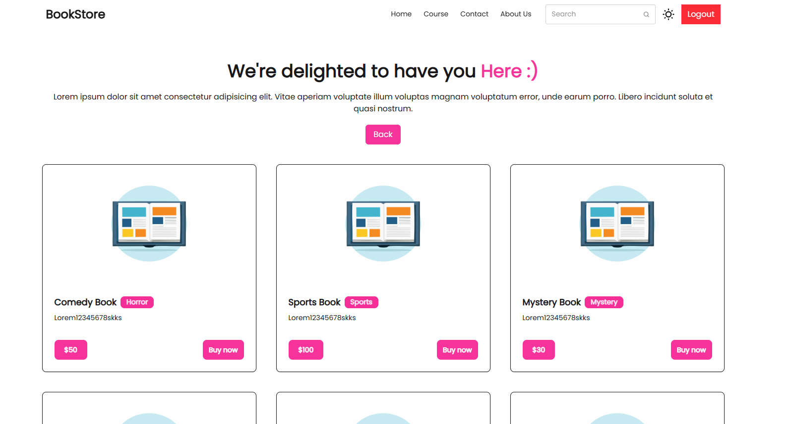

# 📚 BookStore App (MERN)

A full-stack BookStore web application built using the MERN stack with user authentication, protected routes, and a responsive UI.

---

## 🚀 Tech Stack

**Frontend:** React.js, React Router, Axios, React Hook Form, Tailwind CSS
**Backend:** Node.js, Express.js, MongoDB, Mongoose

---

## ✨ Features

* 🔐 Signup / Login / Logout
* 🔒 Protected Routes
* 📚 Book APIs
* 🌙 Dark / Light Mode
* 💾 LocalStorage Auth Persistence
* 🔔 Toast Notifications

---
📸 Screenshots

🏠 Home Page

🔐 Login Page

📝 Signup Page

📚 Course Page

---

## ⚙️ Setup

### 1. Clone Repo

```
git clonehttps://github.com/ViJaya-kh22/BookStoreApp.git
```

### 2. Backend

```
cd backend
npm install
```

Create `.env`:

```
PORT=4001
MongoDBURI=mongodb://localhost:27017/bookStore
```

Run:

```
npm run dev
```

### 3. Frontend

```
cd frontend
npm install
npm run dev
```

---

## 🔑 API

* POST `/user/signup`
* POST `/user/login`
* GET `/book`

---

## 🧠 Concepts

* MVC Architecture
* REST APIs
* Context API (Auth)
* React Hooks
* Middleware

---

## 🚀 Future Improvements

* JWT Authentication
* Password Hashing (bcrypt)
* Deployment (Vercel + Render)
* Integrate real book data from database instead of static content
* Add search functionality for books

---

## 👨‍💻 Author

Vijaya Khavnekar

---

⭐ Star the repo if you like it!
